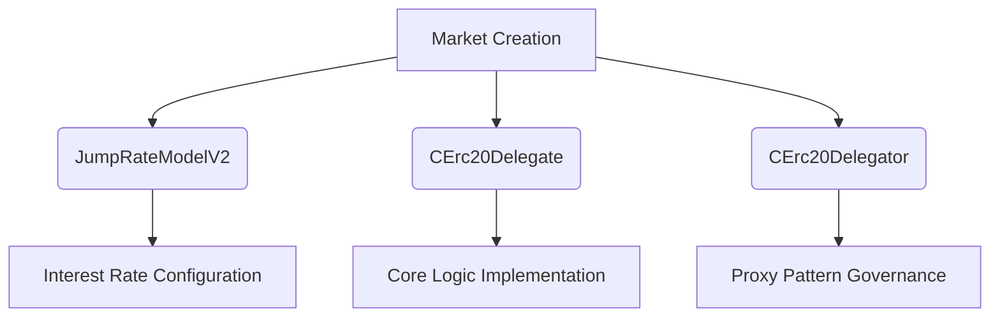
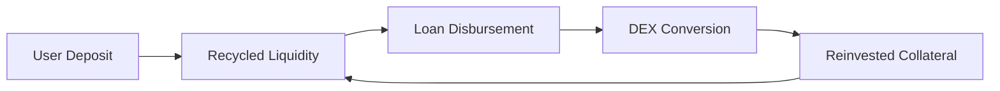
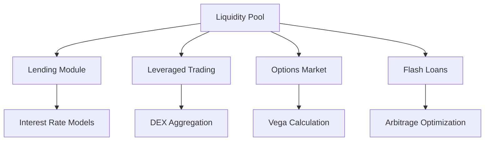

# Analyzing DeFi Lending Products: Compound Extended Edition

## Understanding DeFi Lending Mechanics

Decentralized Finance (DeFi) has revolutionized traditional financial systems by introducing trustless, transparent, and permissionless financial instruments. At the forefront of this movement, **Compound Finance** has emerged as a pioneering lending protocol, enabling users to supply crypto assets and earn interest while allowing others to borrow against collateral. This extended analysis delves into security enhancements, optimization strategies, and innovative product extensions built upon Compound's foundational architecture.

## Oracle Manipulation Attacks: Case Studies & Mitigation

### Historical Incident Analysis
In November 2020, Compound suffered an $80 million loss due to price oracle manipulation. The attack exploited its reliance on Coinbase's centralized exchange data feed, which temporarily showed DAI trading at $1.34. This anomaly triggered mass liquidations across user positions.

### Comparative Vulnerability Matrix
| Protocol | Oracle System | Notable Incidents |
|---------|---------------|-------------------|
| Compound | Open Price Feed | Nov 2020 DAI manipulation |
| Harvest Finance | Chainlink | Oct 2020 DAI/USDT manipulation |
| Value DeFi | Uniswap TWAP | Jan 2021 DAI/USDC manipulation |

### Security Enhancement Strategies
1. **Multi-Oracle Architecture Implementation**
   - Primary: Chainlink decentralized oracle network
   - Secondary: Uniswap TWAP verification layer
   - Tertiary: NEST price feeds for cross-chain validation

2. **Dynamic Price Validation System**
   ```solidity
   function validatePrice() internal {
       uint256 chainlinkPrice = getChainlinkPrice();
       uint256 twapPrice = getUniswapTWAP();
       require(
           abs(chainlinkPrice - twapPrice) <= MAX_DEVIATION, 
           "Price deviation exceeds threshold"
       );
   }
   ```

3. **Block-Level Price Caching**
   Implementing a price checkpointing mechanism that updates prices only once per block, preventing flash loan exploitation.

## Reentrancy Attack Prevention Framework

### Attack Vector Anatomy
1. **External Call Vulnerability**: Unchecked external function calls
2. **State Update Timing**: Critical state changes occurring after external interactions

### Protective Implementation Pattern
```solidity
modifier nonReentrant() {
    require(!locked, "Reentrancy detected");
    locked = true;
    _;
    locked = false;
}

function withdraw(uint256 amount) external nonReentrant {
    // 1. Check user balance
    uint256 userBalance = balances[msg.sender];
    require(amount <= userBalance, "Insufficient balance");

    // 2. Update state before external call
    balances[msg.sender] -= amount;

    // 3. Execute external transfer
    (bool success, ) = msg.sender.call{value: amount}("");
    require(success, "Transfer failed");
}
```

### Compound's Implementation Insights
- **CToken Contract Security**: All critical functions incorporate reentrancy guards
- **State Update Pattern**: Balance modifications consistently precede external transfers
- **Guardian Contract Integration**: Additional layer for suspicious transaction monitoring

## Contract Deployment Optimization

### Current Deployment Architecture


### Factory Contract Implementation
```solidity
contract CTokenFactory {
    event MarketCreated(address indexed cToken, address indexed underlying);

    function createMarket(
        address underlying,
        uint256 initialExchangeRateMantissa,
        uint256 reserveFactorMantissa
    ) external returns (address) {
        // 1. Deploy implementation contract
        CErc20Delegate implementation = new CErc20Delegate();
        
        // 2. Create proxy contract
        CErc20Delegator proxy = new CErc20Delegator(
            address(implementation),
            comptroller,
            interestRateModel,
            initialExchangeRateMantissa,
            name,
            symbol,
            decimals
        );
        
        // 3. Register with comptroller
        comptroller._supportMarket(proxy);
        
        emit MarketCreated(address(proxy), underlying);
        return address(proxy);
    }
}
```

## Product Extension Opportunities

### Leveraged Trading Protocol Design

#### Capital Flow Optimization


#### Interest Rate Model Comparison
| Parameter | Compound v2 | Alpaca V2 |
|---------|-------------|-----------|
| Base Rate | 5% | 0% |
| Multiplier | 45% | 20% |
| Jump Multiplier | 550% | 1300% |
| Kink Threshold | 80% | 90% |

### Yield Farming Enhancement Framework

#### Risk Management Matrix
| Risk Factor | Mitigation Strategy | Protocol Implementation |
|------------|---------------------|--------------------------|
| Impermanent Loss | Dynamic position rebalancing | Alpha Homora v2 |
| Liquidation Risk | Real-time LTV monitoring | Alpaca Finance |
| Capital Efficiency | Cross-pool optimization | Beefy Finance |

## Unified Financial Platform Architecture

### Modular System Design


### Cross-Module Interaction
1. **Price Oracle Module** feeds data to all components
2. **Lending Engine** provides base liquidity for leveraged positions
3. **DEX Aggregator** optimizes swap execution across trading modules

## FAQ: Advanced DeFi Concepts

**Q: How does Compound's multi-oracle system prevent flash loan attacks?**  
A: By implementing block-level price caching and cross-validating Chainlink's decentralized feeds against Uniswap's TWAP mechanism, the system prevents short-term price manipulation through temporal price verification.

**Q: What distinguishes leveraged yield farming from traditional liquidity provision?**  
A: Leveraged farming amplifies capital efficiency by allowing users to borrow additional assets against their collateral, potentially increasing yield generation capacity by 3-5x while maintaining equivalent risk exposure.

**Q: How do modern interest rate models balance capital utilization?**  
A: Alpaca's tiered model employs three distinct phases:  
1. Linear growth phase (0-50% utilization)  
2. Plateau phase (50-90% utilization)  
3. Exponential growth phase (90-100% utilization)  
This structure maintains liquidity availability while incentivizing depositors during high utilization periods.

**Q: What are the key components of a secure DeFi deployment?**  
A: The essential elements include:  
- Reentrancy guards in all external interaction functions  
- Multi-layered oracle validation systems  
- Automated market support mechanisms  
- Modular contract architecture with upgradeability  

**Q: How do flash loans impact DeFi security?**  
A: While providing valuable arbitrage opportunities, flash loans enable price manipulation attacks through temporary liquidity spikes. Effective defenses include:  
- Block-level price anchoring  
- Multi-block validation periods  
- Transaction sequence verification  

**Q: What future developments can we expect in DeFi lending?**  
A: Emerging trends include:  
- Cross-chain liquidity aggregation  
- NFT-based collateral solutions  
- AI-driven risk assessment models  
- Regulatory-compliant tokenized assets  

👉 [Explore DeFi opportunities securely](https://bit.ly/okx-bonus)

## Technical Implementation Roadmap

### Phase 1: Core Infrastructure
- Oracle Aggregation Layer
- Reentrancy Protection Framework
- Interest Rate Model Library

### Phase 2: Product Development
- Leveraged Trading Engine
- Yield Optimization Module
- Cross-Chain Liquidity Bridge

### Phase 3: Ecosystem Expansion
- Options Market Integration
- Insurance Protocol Connection
- Governance Token Launch

## Risk Assessment Matrix

| Component | Risk Level | Mitigation Strategy | Implementation Status |
|---------|------------|---------------------|-----------------------|
| Oracle System | Medium | Multi-source validation | Completed |
| Reentrancy Protection | Low | Guard implementation | Completed |
| Interest Rate Model | Medium | Dynamic adjustment | In Progress |
| Cross-Chain Functionality | High | Zero-knowledge proofs | Planning |

## Conclusion

The evolution of DeFi lending protocols like Compound demonstrates the sector's capacity for continuous innovation and security enhancement. By implementing multi-layered oracle validation, standardized reentrancy protections, and modular product architectures, the next generation of DeFi platforms can achieve unprecedented levels of security and capital efficiency. As the ecosystem matures, we can expect to see greater interoperability, sophisticated risk management tools, and institutional-grade financial products becoming standard features of decentralized finance.

👉 [Stay ahead in DeFi innovation](https://bit.ly/okx-bonus)